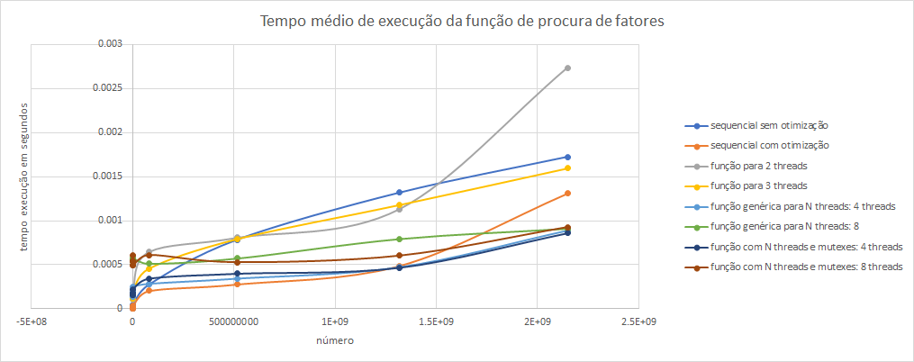

**<h1 style="text-align:center">Sistemas Paralelos e Distribuídos</h1>**
<h2 style="text-align:center">Relatório Técnico 1</h2>
<h3 style="text-align:center">Autores</h3>
<h3 style="text-align:center">Bruno Mendes</h3>
<h3 style="text-align:center"><a href="mailto:a62181@ualg.pt" >a62181</a><h3>

</br>
<div style="text-align:center">
<p></p>
<p style="font-size:20px">Universidade do Algarve</p>
<p style="font-size:18px">Faculdade de Ciências e Tecnologia</p>
<p style="font-size:16px">Engenharia Informática<p>
<p style="font-size:16px">18/2/2020<p>
</div>

<div style="page-break-after: always;"></div>

# Resumo
O presente relatório descreve a implementação e análise de vários programas de cálculo de factores de um dado valor. Para este relatório foram implementadas as funções de forma a executar sequencialmente e em paralelo, onde serão recolhidados os tempos de execução e avaliado o desempenho demonstrando a importância do processsamento em paralelo.

<div style="page-break-after: always;"></div>

# Agradecimentos

<a href="mailto:a57652@ualg.pt">Diogo Cordeiro</a> - por me lembrar que a aceleração e eficiência existiam.
<a href="mailto:a61121@ualg.pt">Leandro Quintans</a> - pela discussão/sugestão de ideias, testes de velocidade do meu código e competição.

<div style="page-break-after: always;"></div>

# Indice


<!-- @import "[TOC]" {cmd="toc" depthFrom=1 depthTo=6 orderedList=false} -->

<!-- code_chunk_output -->

- [Resumo](#resumo)
- [Agradecimentos](#agradecimentos)
- [Indice](#indice)
- [1. Introdução](#1-introdução)
  - [1.1. Objectivos](#11-objectivos)
  - [1.2. Motivação](#12-motivação)
  - [Metedologia](#metedologia)
  - [1.3. Estratégia](#13-estratégia)
  - [1.4. Principais resultados/conclusões obtidos](#14-principais-resultadosconclusões-obtidos)
  - [1.5. Estrutura Do Relatório](#15-estrutura-do-relatório)
- [2. Enquadramento](#2-enquadramento)
  - [2.1. Conceitos](#21-conceitos)
  - [2.2. Ambiente de Execução](#22-ambiente-de-execução)
- [3. Execução com processamento Sequencial](#3-execução-com-processamento-sequencial)
  - [3.1. Descrição do Problema](#31-descrição-do-problema)
  - [3.2. Alternativas de Desenho](#32-alternativas-de-desenho)
  - [3.3. Implementações](#33-implementações)
  - [3.4. Recolha de dados](#34-recolha-de-dados)
- [4. Execução com processamento em paralelo](#4-execução-com-processamento-em-paralelo)
  - [4.1. Descrição](#41-descrição)
  - [4.2. Alternativas de Desenho](#42-alternativas-de-desenho)
  - [4.3. Implementações](#43-implementações)
  - [4.4. Recolha de dados](#44-recolha-de-dados)
- [5. Análise de resultados e Discussão](#5-análise-de-resultados-e-discussão)
  - [5.2. Análise](#52-análise)
    - [5.2.1. Tempo de procura de factores em processamento paralelo vs sequencial](#521-tempo-de-procura-de-factores-em-processamento-paralelo-vs-sequencial)
    - [5.2.2. Tempo de ordenação dos resultados das funções de processamento paralelo e sequencial](#522-tempo-de-ordenação-dos-resultados-das-funções-de-processamento-paralelo-e-sequencial)
    - [5.2.3. Tempo total de execução das funções](#523-tempo-total-de-execução-das-funções)
    - [5.2.4. Aceleração das funções de threads em relação às sequênciais](#524-aceleração-das-funções-de-threads-em-relação-às-sequênciais)
    - [5.2.5. Eficiência das funções de threads em relação ao número de processadores](#525-eficiência-das-funções-de-threads-em-relação-ao-número-de-processadores)
- [6. Conclusão](#6-conclusão)
- [7. Referências](#7-referências)

<!-- /code_chunk_output -->

<div style="page-break-after: always;"></div>

# 1. Introdução

## 1.1. Objectivos
* Implementar uma ou várias funções sequencias e com paralelismo que descubram os [factores de um dado número](https://www.khanacademy.org/math/pre-algebra/pre-algebra-factors-multiples) e ordenar os mesmos.
* Implementar e utilizar as regras para saber se 2, 3, 4, 5, 6, 9 e 10 sao factores.
* Comparar os resultados entre as funções sequenciais e funções com paralelismo, com _pthreads_ e _OpenMP_.

## 1.2. Motivação
A motivação deste relatório é entender quando se deve usar processamento em paralelo e o quão vantajoso é este comparado com processamento sequencial. No nosso caso vamos procurar os factores de um número. Por exempo se uma pessoa tentar descobrir os factores sozinha, terá que dividir o número dado por todos os números até a raiz do dado número. Se o número for 121 será necessário dividir o número 11 vezes, mas se este processo for feito com a ajuda de alguém, pode-se separar as tarefas, uma pessoa divide de 1 até 6 e a outra faz de 7 até 11, assim há poupança de tempo. No caso dos computadores é semelhante só que tudo numa questão de milisegundos, e para tal este relatório foi feito para demonstrar que a programação paralela é vantajosa para situações em que a função não precise ser executada sequencialmente.

## Metedologia

## 1.3. Estratégia
* **Não utilizar recursividade:** A recursividade requer que vários resultados sejam mantidos em memória física, tendo em conta que um dos objectivos é programar em paralelo de forma a que um programa execute mais rapidamente utilizando _threads_. No entanto, a utilização de mais _threads_ implica a utilização de mais memória, então para evitar a escassez de memória física, decidi não utilizar recursividade
* **Utilização de comandos e argumentos:** Permite que não seja necessário estar a comentar código para que outras funções executem, facilitando o teste de código e permite que várias combinações de inputs sejam possíveis através do uso da linha de comandos
* **Uso de testes unitários:** Permite a facilidade de teste  de código e evitar erros
* **Uso de macros:** Facilidade de usar funções
* **Uso de _Strings_:** Facilidade em manipular cada elemento da _String_ em realação aos _Integers_
* **Criar múltiplas implementações:** A criação de múltiplas implementações é importante porque permite que hajam mais testes e logo mais resultados para analisar
* **Utilizar _makefiles_:** para evitar reescrever o comando para compilar o código, criou-se um ficheiro makefile para facilitar o processo.
* **Utilizar múltiplos ficheiros de código:** Separação do código por múltiplos ficheiros de forma a facilitar a leitura do mesmo

## 1.4. Principais resultados/conclusões obtidos
<!-- Os principais resultados obtidos foram que as funções pthreads serão mais eficientes quanto maior for o número de operações necessárias, também se notou que apesar de o tempo gasto no cpu por parte das funções paralelas ser maior o seu tempo de execução real é bastante inferior porque a função é dividida em múltiplos bocados e esses bocados são executados em paralelo -->

## 1.5. Estrutura Do Relatório
Os próximos capitulos vão enquandrar o leitor na linguagem ténica e mostrar como foi feito o desenvolvimento das funções e a recolha e análise das mesmas.
<div style="page-break-after: always;"></div>

# 2. Enquadramento
## 2.1. Conceitos
* **_qsort_:** método de ordenação de um conjunto de elementos sobre uma regra definida com velocidade $O(n Log(n))$ (ver: [_qsort_](https://en.wikipedia.org/wiki/Qsort))
* **_insertion sort_:** método de ordenação que ordena um item de cada vez da lista, apesar da velocidade deste ser no pior dos casos de $O(n^2)$. No entanto se os elementos tiverem quase ordenados então o tempo de execução é quase $O(n)$
(ver: [_insertion sort_](https://en.wikipedia.org/wiki/Insertion_sort)).
* **factores de um número:** número que divido por outro tem resto de 0, sendo o divido e o resultado dois dos seus factores
* **processo:** programa em execução.
* **_thread_**: tarefa de um processo que pode ser executado em simultâneo.
* **_POSIX threads_ (_p\_threads_):** padrão _[POSIX](https://pt.wikipedia.org/wiki/POSIX)_ para _threads_, o qual define a [API](https://pt.wikipedia.org/wiki/Interface_de_programa%C3%A7%C3%A3o_de_aplica%C3%A7%C3%B5es) das _threads_ utilizadas neste programa.

* **_mutex_ (mutual exclusion)** é um mecanismo de controlo de acesso a um recurso, permitindo que apenas seja acessido por um limite de _threads_

* **processamento sequencial:** processamento em que os comandos são executados de forma sequencial, ou seja, um após outro
* **processamento em paralelo:** processamento em que 2 ou mais comandos são executados em simulatâneo.
* **User CPU time:** "O tempo que o CPU gasta a executar, no espaço do utilizador, o processo que derivou do programa A"
* **System CPU time:** "O tempo que o CPU gasta a executar, no espaço do núcleo, o processo que derivou do programa A, i, é, a execução de rotinas do sistema opetativo desencadeadas".
* **Waiting time:** "tempo de espera até que uma operação de E/S tenha sido concluída ou devido à execução de outros processos".
* **Aceleração(S):**"é definida como a razão entre o tempo de execução dum problema num único processador t1 e o tempo necessário na resolução desse mesmo problema em p processadores idênticos, tp": (ver: [aceleração](https://tutoria.ualg.pt/2019/pluginfile.php/133291/mod_resource/content/1/2.performance_eval.pdf))
$S=\frac{t_1}{t_p}$ (1)
* **Eficiência:** "Define-se eficiência como sendo a fracção de tempo que osprocessadores realizam trabalho útil, ou seja, o quociente entre aceleração e o número de processadores", ou seja, a capacidade de aproveitamento dos recursos à diposição do processador.(ver: [eficiência](https://tutoria.ualg.pt/2019/pluginfile.php/133291/mod_resource/content/1/2.performance_eval.pdf))
$E=\frac{S}{p}$(2)


<div style="page-break-after: always;"></div>

## 2.2. Ambiente de Execução
Os programas foram escritos em [C](https://en.wikipedia.org/wiki/C_(programming_language)), executados no [WSL](https://en.wikipedia.org/wiki/Windows_Subsystem_for_Linux) com o processador [intel i7-7700k](https://ark.intel.com/content/www/us/en/ark/products/97129/intel-core-i7-7700k-processor-8m-cache-up-to-4-50-ghz.html)

# 3. Execução com processamento Sequencial
## 3.1. Descrição do Problema
O problema em questão é descobrir os factores de um dado número usando a multiplicação o mínimo possível. Para tal foram usadas algumas regras conhecidas, como:
* **divisão por 2:** se o último digito de um número for par então o número é divisível por 2;
* **divisão por 3:** se a soma dos dígitos for um múltiplo de 3, então o número é divisível por 3, então se somar-mos os digitos da soma dos digitos até ficarmos apenas com um digito no final, então o resultado final vai ser um número entre 1 e 9, logo se esse resultado for 3, 6 ou 9, nós sabemos que é divisível por 3
* **divisão por 4:** se os últimos 2 números forem divisíveis por 4, então o número é divisível por 4
* **divisão por 5:** se o último número for 0 ou 10, então é divisível por 5
* **divisão por 6:** se for divisível por 2 e 3 então também é divisível por 6
* **divisão por 9:** semelhante ao 3, mas a soma dos digitos tem de ser igual a 9
* **divisão por 10:** se o último digito for 0 ou se for divisível por 2 e por 5, então é divisível por 10.
Para a divisão por 2, para is buscar o ultimo digito

A implementação destas funções tem como o objetivo de evitar fazer cálculos desnecessários. No entanto para acedermos ao último dígito de um elemento em C temos que dividir o elemento e considerando que estamos a evitar fazer divisões o máximo possível, então,converteu-se o número para _String_ assim é facil aceder ao último dígito e apenas temos que converter esse para _Integer_ e assim só teremos que ver se o último elemento é um 0, 2, 4, 6 ou 8.
Para o 3 teve-se que fazer uma soma dos elementos, mas como estamos a usar _Strings_ foi facil de somar digito a digito, até chegarmos ao ponto em que só temos um digito.
Para o quatro não houve solução simples, porque teve-se que recorrer à divisão, mas como foi só à divisão dos últimos 2 digitos em que não é necessário quase processamento nenhum.
O cinco, seis e dez foram baseados nas implementações do dois e a do nove na do três.
De resto foi só implementar um ciclo que executava as funções enquanto estas fossem menores ou iguais que a raíz do dado número e guardava os números no array.
Esse array depois é ordenado com o _insertion sort_.


## 3.2. Alternativas de Desenho
Para construir a função do 3, ponderou-se inicialmente em fazer recursivamente a função. No entanto as funções recursivas requerem que seja guardada memória temporária, logo se tivessemos múltiplas _threads_ a fazer cálculo e soma de digitos até ficarmos só com 1, haveria uma grande quantidade de memória que estaria a ser ocupada injustificadamente, esta também é a razão pela qual não se utilização do _mergesort_.
Também se poderou utilizar o primeiro elemento do ARGV para decidir que tipo de função iria ser chamada, no entanto, para a mesma função nós iriamos querer imprimi-la com prints e sem prints, com tempo e sem tempo, com sort e sem sort, as vezes 2 destes elementos misturados, e utilizando so o primeiro elemento do argv, teriamos que implementar 9 diferentes alternativas para a utilização da mesma função, e se tivessemos 2 ja seriam 18, então, recorreu-se a utilização da função [_getopt()_](https://www.gnu.org/software/libc/manual/html_node/Example-of-Getopt.html) que também foi utilizada no [guia 0](https://tutoria.ualg.pt/2019/pluginfile.php/132031/mod_resource/content/1/00-Revis%C3%B5es.html) da cadeira.
## 3.3. Implementações
Foram feitas 2 implementações para a versão sequencial:
* A primeira implementação apenas executa todas as funções até à $\sqrt(n)$ sem ter em consideração aos resultados anteriores.
* A versão otimizada tem em consideração aos resultados obtidos anteriormente, que caso um número não seja divisível por 2 então não irá dividir por nenhum número par, se não for divisível por 3, então não irá dividir por 6 nem por 9, se não for divisível por 5, então não irá dividir por 9, isto faz com que o número de itereações seja inferior.
## 3.4. Recolha de dados
Ambas as implementações foram executadas 100 vezes para cada um dos números os $10En$ em que n é qualquer inteiro entre 0 e 10 com _insertion_sort_, anotando o _real time_, _user time_ e também o _system time_ usando uma script de bash, que correu o seguinte comando para os múltiplos números
```bash
#sequencial sem otimização
$ time ./a.out -l1 $((10**$i))#i é qualquer número inteiro entre 1 e 10
#sequencial com otimização
$ time ./a.out -l2 $((10**$i))
```

<div style="page-break-after: always;"></div>

# 4. Execução com processamento em paralelo

## 4.1. Descrição
O problema descrito é o mesmo descrito no [capítulo de processamento squencial](#3-1-Execução-com-processamento-sequencial). Mas como agora temos várias _threads_ podemos repartir o processo em várias partes, em que cada parte requere um trabalho idêntico, porque caso fique muito desequilibrado, não irá compensar em ter um processamento paralelo.
## 4.2. Alternativas de Desenho
Para colocar valores num array existem algumas maneiras de o fazer sem que as _threads_ sobreponham os valores umas em cima das outras. Pode-se simplesmente usar uma formula matemática para calcular as posições dos arrays de forma a que nunca se sobreponham, pode-se alocar um array a 4 partes diferentes do array no entanto ficam muito dispersos, ou pode-se usar mutexes.
## 4.3. Implementações
Este problema foi implementado de 4 formas diferentes de forma a testar qual seria a melhor maneira de implementar threads para esta situação:
* **Primeira implementação:** Utilizou-se 2 _threads_ em que uma faz as funções de 2, 3, 4, 5, 6, 9 e 10 e a outra faz o resto das operações, e colca -se os valores e aloca-se uma parte do array final para colocar estes resultados
* **Segunda implementação:** Utilizou-se 3 _threads_ semelhante à situação anterior, só que em vez de uma _thread_ fazer as divisões todas (excepto aquelas 7), temos uma _thread_ para a divisão de impares e outra de pares,  o número não for divisivel por 2, então a _thread_ não irá executar
* **Terceira Implementação:** Esta implementação, à sugestão do aluno <a href="mailto:a61121@ualg.pt">Leandro Quintans</a>, dividir o array em N partes, dependendo da escolha do utilizador e executar N threads em que as threads vao fazer da posição
$nThread * \frac{nInput}{nTotalThreads} + 1$  até $nThread * \frac{nInput}{nTotalThreads}$, caso o número seja impar, as _threads_ ignoram os números pares, no entanto colocam a alocar os valores numa parte do array alocada às mesmas
* **Quarta Implementação:** Semelhante à anterior, só que são utilizados mutexes, logo os valores sao colocados de forma consecutiva
## 4.4. Recolha de dados
Todas as implementações foram executadas 100 vezes para cada um dos números 120, 5231, 52992, 999999, 2352992, 78954358, 514879867, 1318231997 e 2147483646 com qsort e sem _qsort_ para saber também qual era o peso que a ordenação tem no tempo de execução total, e registou-se a média de tempos de cada situação.
Também se recolheram dados utilizando o comando seguido em baix para recolha do tempo do user CPU vs sytem CPU
```bash
$ time ./a.out -comandos <numero>
```
<div style="page-break-after: always;"></div>

# 5. Análise de resultados e Discussão

## 5.2. Análise
### 5.2.1. Tempo de procura de factores em processamento paralelo vs sequencial

</br>
<div id="graph1">
<!--  -->

    <h6 style="text-align:center">Gráfico 1 - comparação do tempo de execução da função factorial</h6>
</div>
</br>

Observando os dados obtidos no [gráfico 1](#graph1), podemos induzir que:
* O processamento sequencial é de mais eficiente para valores que precisam de poucas divisões porque para inicilizar uma thread tem algum custo de tempo e se o valor dado for baixo então o processamento sequencial termina os cálculos antes das _p\_threads_ serem usadas efetivamente
* Ainda no processamento sequencial podemos observar que a função otimizada executa sempre mais rapidamente e em algumas situações quase três vezes mais rapidamente (ver [tabela 1](#tabela1))
* A função de 2 threads tem um tempo de execução elevado. Isso deve-se ao facto da forma como foi implementada, o trabalho distribuido pelas 2 _threads_ está muito desequilibrado. Uma destas descobre apenas os factores de um dado número para 2, 3, 4, 5, 6, 9 e 10, enquanto a outra faz dos outros todos, para casos em que o número seja por exemplo 2147483646, esta thread terá um tempo de utilização muito menor que a outra, esta descobre 7 factores enquanto a outra irá ter que descobrir 2147483639 factores. Esta implementação não cumpre o objetivo de demonostrar que para valores elevados o processamento em paralelo é de facto mais eficiente
* A função de 3 threads apenas "vence" a função sequencial sem otimização, isto é de esperar devido a problemas semelhantes com a implementação da mesma. O trabalho distribuido pelas _threads_ é muito desequilibrado. Esta implementação tem o mesmo problema que a implentação da função de 2 _threads_ , uma das _threads_ também está a ser utilizada para executar as funções de 2, 3, 4, 5, 6, 9 e 10, o que para valores elevados, não faz uma diferença significativa. O outro problema é que esta função, como mencionado, tem uma thread para resolver os números pares e a outra os impares, no entanto se o número não for divisível por 2, então a _thread_ pára de executar. Se o número for um ímpar elevado então vamos ter apenas uma _thread_ a executar o que não é vantajoso a uma função sequencial, tendo em consideração estes pontos também podemos afirmar que esta implementação falha nos objetivos definidos
* Como podemos observar as funções genérica para N _threads_ (4 e 8 neste caso) tanto as com e sem mutexes, são as mais rápidas a executar para números que poderão ter uma grande quantidade de factores. Isto deve-se ao facto de esta implementação não ter _threads_ dedicadas para pares / impares e as funções das 7 funções indicadas, então teremos sempre N _threads_ ativas a procurar factores o que faz com que esta implementação seja mais eficiente para a procura dos valores

### 5.2.2. Tempo de ordenação dos resultados das funções de processamento paralelo e sequencial

</br>
<div id="graph2">
<!--  -->

    <h6 style="text-align:center">Gráfico 2 - comparação do tempo de ordenação nas diferentes funções de procura de factores</h6>
</div>
</br>

Observando os dados obtidos no [gráfico 2](#graph2), podemos induzir que:
* A ordenação a funções sequenciais é bastante mais rápida porque sabemos até que posição do array foi preenchida com valores, logo só precisamos ordenar até a posição do ultimo valor inserido
* A ordenação a funções em paralelo (a implementação de 2 threads, 3 threads, e genérica sem mutexes) não é tão linear porque os valores são colocados na parte do array que foi alocada à _thread_, logo os valores estão dispersos pelo array o que leva que o número de posições do array que precisa de ser ordenado seja superior ao número de factores encontrados, e como quanto maior for o número dado maior será o espaço alocado do array e por sua vez o tempo de ordenação também será maior.
* A ordenação a funções com processamento com mutexes, já temos controlo sobre o acesso ao array, logo podemos colocar todos os valores no array de forma a que saibamos até que ponto podemos fazer a ordenação, fazendo com que esta seja quase instântanea

### 5.2.3. Tempo total de execução das funções

<div id="graph3">
<!--  -->

    <h6 style="text-align:center">Gráfico 3 - tempo total de execução</h6>
</div>
</br>

Observando os dados obtidos no [gráfico 3](#graph3), podemos induzir que:
* Apesar das funções genéricas de paralelismo serem mais rápidas a executar a função dos factores, se estas não forem bem construidas, o seu tempo de execução total será elevado, como se pode ver, as funções com mutexes são muito mais rápidas a executar que as sem mutexes.
* Também se pode observar nas funções de processamento em paralelo, as funções que executam com 4 _threads_ são ligeiramente mais rápidas que das de 8 _threads_, no entanto o crescimento das funções de 8 _threads_ é bastante inferior ao de 4 _threads_, por exemplo para a última implementação o crescimento de 4 _threads_ vs o de 8 _threads_ é de aproximadamente 334% a mais, o que poderá indicar que para números superiores ao testado, as 8 _threads_ são de facto mais eficientes que 4


### 5.2.4. Aceleração das funções de threads em relação às sequênciais

<div id="graph4">
<!--  -->

    <h6 style="text-align:center">Gráfico 4 - Aceleração das funções de threads</h6>
</div>
</br>


Observando os dados obtidos no [gráfico 4](#graph4), podemos induzir que:
* As funções de _threads_ só são mais rápidas que as funções sequenciais a partir de números na ordem dos $10^9$, no entanto têm um crescimento linear a partir desse número


### 5.2.5. Eficiência das funções de threads em relação ao número de processadores

<div id="graph5">
<!--  -->

    <h6 style="text-align:center">Gráfico 4 - Eficência das funções de threads</h6>
</div>
</br>


Observando os dados obtidos no [gráfico 5](#graph5) e da [tabela 12](#tabela12), podemos induzir que:
* As função de 4 _threads_ é 2 vezes mais eficiente que a de 8 _threads_


Observações finais:
* Comparando os valores das tablelas [9](#tabela9) ou [10](#tabela10), podemos observar que para as funções sequenciais a divergência entre o tempo gasto total e o tempo gasto pelo cpu são bastante semelhantes enquando nas funções são bastante inferiores, isso deve-se ao facto de system CPU time ser o tempo total de execução das funções dentro do núcleo, mas como estas funções são executadas em paralelo, então o user CPU time é apenas uma fração do tempo de execução total dentro do CPU. Podemos então ver que o CPU de facto desperdiça mais tempo a executar as funções em paralelo, no entanto estas estaõ dividas por _threads_ o tempo total é bastante inferior, para o caso de N threads com mutexes: 4 threads podemos observar que a velocidade ganha é $\frac{0.203}{0.095} = 2.13$ o que significa que a função foi pelo menos 2x mais rápida do que se tivesse sido realiza em sequencial.

<div style="page-break-after: always;"></div>

# 6. Conclusão
O processamento em paralelo é de facto mais eficiente que o processamento sequencial quanto maior for o número de comandos do processo. No entanto para que possamos aplicar o processamento em paralelo temos que entender a natureza do problema e identificar de quais são os recursos que só podem ser acedidos por uma _thread_, no nosso caso era só dividir o número total de operações pelas múltiplas _threads_ e atualizar o array que guarda os resultados finais  com mutexes. Podemos que concluir que o processamento paralelo apesar de ser mais complicado a implementar é muito mais rápido em termos de processamento para resolver problemas que requerem grande quantidade processamento computacional e que para cada problema também temos que ter em consideração o número das _threads_ versus a complexidade do problema, o que seria um caso de estudo interessante.

<div style="page-break-after: always;"></div>

# 7. Referências

[1] [como utilizar "opções" nos comandos](https://tutoria.ualg.pt/2019/pluginfile.php/132031/mod_resource/content/1/00-Revis%C3%B5es.html)
[2] [como utilizar multiplas opções associadas a um comando](https://www.gnu.org/software/libc/manual/html_node/Getopt-Long-Option-Example.html)
[3] [como criar um foreach em c](https://en.wikipedia.org/wiki/Foreach_loop#C)
[4] [como converter um  char para int em c, ver reposta de Paul Tomblin](https://stackoverflow.com/questions/868496/how-to-convert-char-to-integer-in-c)
[5] [como criar um array de funções, ver resposta de Swedgin](https://stackoverflow.com/questions/5309859/how-to-define-an-array-of-functions-in-c/35756809)
[6] [função de tempo da Professora Margarida Moura, exericio 5](https://tutoria.ualg.pt/2019/pluginfile.php/132032/mod_resource/content/0/Guia1-Exerc%C3%ADcios%20Iniciais.pdf)
[7] [implementação do Merge Sort em c](https://www.geeksforgeeks.org/merge-sort/)
[8] [função de clonar strings do Professor Pedro Guerreiro](https://tutoria.ualg.pt/2019/pluginfile.php/116217/mod_resource/content/12/our_strings.c)
[9] [converter string para long, ver resposta de Spikatrix](https://stackoverflow.com/questions/7021725/how-to-convert-a-string-to-integer-in-c)
[10] [implementação do insertion sort em c](https://www.geeksforgeeks.org/insertion-sort/)
[11] [exemplo de fazer um sumatório devalores de um array com pthreads](https://www.geeksforgeeks.org/sum-array-using-pthreads/)
[12] [exemplos de como criar e utilizar pthreads](https://computing.llnl.gov/tutorials/pthreads/?fbclid=IwAR1EzFsCa-cjQ_eluOzqvMF-agu726Wcs3rKAXqQyLp-oti7nrWuBnYXgmw#PthreadsAPI)
[13] [calculadora de factores](https://www.calculatorsoup.com/calculators/math/factors.php)
[14] [videos de como calcular os fatores com 2, 3, 4, 5, 6, 9 e 10 da Khan Academy](https://www.khanacademy.org/math/pre-algebra/pre-algebra-factors-multiples)
[15] [como escrever um relatório técnico](http://w3.ualg.pt/~jmartins/tecnicascomunicacao/Como.escrever.um.relat%C3%B3rio.pdf)
[16] [imagem do cpu](https://pplware.sapo.pt/software/intel-software-overclock/)
[17] [processamento em paralelo e threads](https://tutoria.ualg.pt/2019/pluginfile.php/137807/mod_resource/content/0/3.Processamento%20paralelo.pdf)
[18] [API](https://pt.wikipedia.org/wiki/Interface_de_programa%C3%A7%C3%A3o_de_aplica%C3%A7%C3%B5es)
[19] [POSIX](https://pt.wikipedia.org/wiki/POSIX)
[20] [Gerar C-Docs](http://www.doxygen.nl/index.html)
[21] [Lista de como escrever funções em Markdown](https://csrgxtu.github.io/2015/03/20/Writing-Mathematic-Fomulars-in-Markdown/)
[22] [qsort](https://en.wikipedia.org/wiki/Qsort)
[23] [Pdfs de Avaliação de Performance da Professora Margarida Moura da cadeira de SPD](https://tutoria.ualg.pt/2019/pluginfile.php/133291/mod_resource/content/1/2.performance_eval.pdf)
[24] [Definição de eficiência e aceleração da professora Margarida Madeira](https://tutoria.ualg.pt/2019/pluginfile.php/133291/mod_resource/content/1/2.performance_eval.pdf)
https://en.wikipedia.org/wiki/Insertion_sort