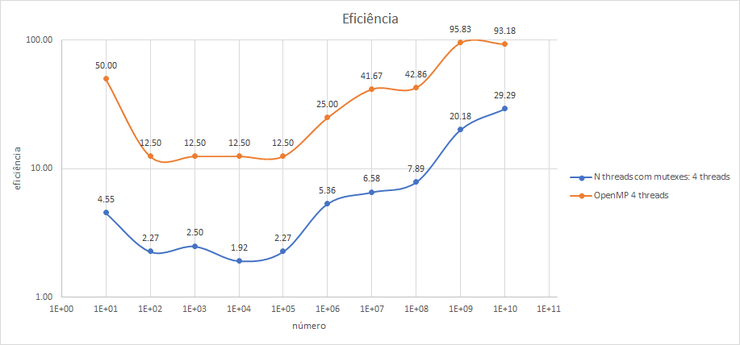
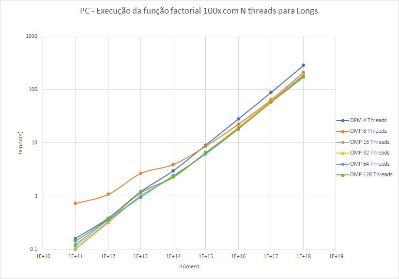

**<h1 style="text-align:center">Sistemas Paralelos e Distribuídos</h1>**
<h2 style="text-align:center">Relatório Técnico 1</h2>
<h3 style="text-align:center">Autores</h3>
<h3 style="text-align:center">Bruno Mendes</h3>
<h3 style="text-align:center"><a href="mailto:a62181@ualg.pt" >a62181</a><h3>

</br>
<div style="text-align:center">
<p></p>
<p style="font-size:20px">Universidade do Algarve</p>
<p style="font-size:18px">Faculdade de Ciências e Tecnologia</p>
<p style="font-size:16px">Engenharia Informática<p>
<p style="font-size:16px">18/2/2020<p>
</div>

<div style="page-break-after: always;"></div>

# Resumo {ignore=true}
O presente relatório descreve a implementação e análise de vários programas de cálculo de factores de um dado valor. Para este relatório foram implementadas as funções de forma a executar sequencialmente e em paralelo, onde serão recolhidados os tempos de execução e avaliado o desempenho demonstrando a importância do processsamento em paralelo.

<div style="page-break-after: always;"></div>

# Agradecimentos {ignore=true}

<a href="mailto:a57652@ualg.pt">Diogo Cordeiro</a> - por me lembrar que a aceleração e eficiência existiam.
<a href="mailto:a61121@ualg.pt">Leandro Quintans</a> - pela discussão/sugestão de ideias, testes de velocidade do meu código e competição.

<div style="page-break-after: always;"></div>

# Índice {ignore=true}

<!-- @import "[TOC]" {cmd="toc" depthFrom=1 depthTo=6 orderedList=false} -->
<!-- code_chunk_output -->

- [1. Introdução](#1-introdução)
  - [1.1. Objectivos](#11-objectivos)
  - [1.2. Motivação](#12-motivação)
  - [1.3. Metedologia](#13-metedologia)
  - [1.4. Estratégia](#14-estratégia)
  - [1.5. Principais resultados/conclusões obtidos](#15-principais-resultadosconclusões-obtidos)
  - [1.6. Estrutura Do Relatório](#16-estrutura-do-relatório)
- [2. Enquadramento](#2-enquadramento)
  - [2.1. Conceitos](#21-conceitos)
  - [2.2. Comandos](#22-comandos)
  - [2.3. Ambiente de Execução](#23-ambiente-de-execução)
    - [2.3.1. FCT-UALG](#231-fct-ualg)
    - [2.3.2. _Personal Computer_](#232-_personal-computer_)
- [3. Desenvolvimento](#3-desenvolvimento)
  - [3.1. Descrição do Problema](#31-descrição-do-problema)
  - [3.2. Implementação das Funções de Divisão de Factores](#32-implementação-das-funções-de-divisão-de-factores)
  - [3.3. Processamento Sequencial](#33-processamento-sequencial)
    - [3.3.1. Alternativas de Desenho](#331-alternativas-de-desenho)
    - [3.3.2. Implementações](#332-implementações)
    - [3.3.3. Recolha de dados](#333-recolha-de-dados)
  - [3.4. Processamento Paralelo com _Pthreads_](#34-processamento-paralelo-com-_pthreads_)
    - [3.4.1. Descrição](#341-descrição)
    - [3.4.2. Alternativas de Desenho](#342-alternativas-de-desenho)
    - [3.4.3. Implementações](#343-implementações)
    - [3.4.4. Recolha de Dados](#344-recolha-de-dados)
  - [3.5. Processamento em Paralelo com _OpenMP_](#35-processamento-em-paralelo-com-_openmp_)
    - [3.5.1. Alternativas de Desenho](#351-alternativas-de-desenho)
    - [3.5.2. Implementações](#352-implementações)
    - [3.5.3. Resultados Obtidos](#353-resultados-obtidos)
- [4. Análise de resultados e Discussão](#4-análise-de-resultados-e-discussão)
  - [4.1. Análise](#41-análise)
    - [4.1.1. Tempo de procura de factores em processamento paralelo vs sequencial](#411-tempo-de-procura-de-factores-em-processamento-paralelo-vs-sequencial)
    - [4.1.2. Aceleração de _Pthreads_ e _OpenMP_](#412-aceleração-de-_pthreads_-e-_openmp_)
    - [4.1.3. Eficiência de _Pthreads_ e _OpenMP_](#413-eficiência-de-_pthreads_-e-_openmp_)
    - [4.1.4. Execução de _OpenMP_ com N _threads_ para _Longs_](#414-execução-de-_openmp_-com-n-_threads_-para-_longs_)
- [5. Conclusão](#5-conclusão)
- [6. Referências](#6-referências)

<!-- /code_chunk_output -->

<div style="page-break-after: always;"></div>

# 1. Introdução

## 1.1. Objetivos
* Implementar uma ou várias funções sequencias e com paralelismo que descubram os [factores de um dado número](https://www.khanacademy.org/math/pre-algebra/pre-algebra-factors-multiples) e ordenar os mesmos.
* Implementar e utilizar as regras para saber se 2, 3, 4, 5, 6, 9 e 10 sao factores.
* Comparar os resultados entre as funções sequenciais e funções com paralelismo, com _pthreads_ e _OpenMP_.

## 1.2. Motivação
A motivação deste relatório é entender quando se deve usar processamento em paralelo e o quão vantajoso é este comparado com processamento sequencial. No nosso caso vamos procurar os factores de um número. Por exempo se uma pessoa tentar descobrir os factores sozinha, terá que dividir o número dado por todos os números até a raiz do dado número. Se o número for 121 será necessário dividir o número 11 vezes, mas se este processo for feito com a ajuda de alguém, pode-se separar as tarefas, uma pessoa divide de 1 até 6 e a outra faz de 7 até 11, assim há poupança de tempo. No caso dos computadores é semelhante só que tudo numa questão de milisegundos, e para tal este relatório foi feito para demonstrar que a programação paralela é vantajosa para situações em que a função não precise ser executada sequencialmente.

## 1.3. Metedologia
* **recolha de dados:** para a recolha de dados foi utilizado a função time para que nós pudessemos não só calcular o tempo de execução da função mas também o tempo efetivo de uso do cpu e o tempo de espera.

## 1.4. Estratégia
* **Não utilizar recursividade:** A recursividade requer que vários resultados sejam mantidos em memória física, tendo em conta que um dos objectivos é programar em paralelo de forma a que um programa execute mais rapidamente utilizando _threads_. No entanto, a utilização de mais _threads_ implica a utilização de mais memória, então para evitar a escassez de memória física, decidi não utilizar recursividade
* **Utilização de comandos e argumentos:** Permite que não seja necessário estar a comentar código para que outras funções executem, facilitando o teste de código e permite que várias combinações de inputs sejam possíveis através do uso da linha de comandos
* **Uso de testes unitários:** Permite a facilidade de teste  de código e evitar erros
* **Uso de macros:** Facilidade de usar funções
* **Uso de _Strings_:** Facilidade em manipular cada elemento da _String_ em realação aos _Integers_
* **Criar múltiplas implementações:** A criação de múltiplas implementações é importante porque permite que hajam mais testes e logo mais resultados para analisar
* **Utilizar _makefiles_:** para evitar reescrever o comando para compilar o código, criou-se um ficheiro makefile para facilitar o processo.
* **Utilizar múltiplos ficheiros de código:** Separação do código por múltiplos ficheiros de forma a facilitar a leitura do mesmo

## 1.5. Principais resultados/conclusões obtidos
Os principais resultados obtidos foram que a programação em paralelo é muito mais eficiente do que a sequencial e mesmo dentro da programação por _pthreads_ e _OpenMP_ existe uma grande diferença, sendo o _OpenMp_ muito mais eficiente.

## 1.6. Estrutura Do Relatório
Os próximos capitulos vão enquandrar o leitor na linguagem ténica e mostrar como foi feito o desenvolvimento das funções e a recolha e análise das mesmas.
<div style="page-break-after: always;"></div>

# 2. Enquadramento
## 2.1. Conceitos
* **_qsort_:** método de ordenação de um conjunto de elementos sobre uma regra definida com velocidade $O(n Log(n))$ (ver: [_qsort_](https://en.wikipedia.org/wiki/Qsort))
* **_insertion sort_:** método de ordenação que ordena um item de cada vez da lista, apesar da velocidade deste ser no pior dos casos de $O(n^2)$. No entanto se os elementos tiverem quase ordenados então o tempo de execução é quase $O(n)$
(ver: [_insertion sort_](https://en.wikipedia.org/wiki/Insertion_sort)).
* **factores de um número:** número que divido por outro tem resto de 0, sendo o divido e o resultado dois dos seus factores
* **processo:** programa em execução.
* **_thread_**: tarefa de um processo que pode ser executado em simultâneo.
* **_POSIX threads_ (_p\_threads_):** padrão _[POSIX](https://pt.wikipedia.org/wiki/POSIX)_ para _threads_, o qual define a [API](https://pt.wikipedia.org/wiki/Interface_de_programa%C3%A7%C3%A3o_de_aplica%C3%A7%C3%B5es) das _threads_ utilizadas neste programa.

* **_mutex_ (mutual exclusion)** é um mecanismo de controlo de acesso a um recurso, permitindo que apenas seja acessido por um limite de _threads_

* **processamento sequencial:** processamento em que os comandos são executados de forma sequencial, ou seja, um após outro
* **processamento em paralelo:** processamento em que 2 ou mais comandos são executados em simulatâneo.
* **User CPU time:** "O tempo que o CPU gasta a executar, no espaço do utilizador, o processo que derivou do programa A"
* **System CPU time:** "O tempo que o CPU gasta a executar, no espaço do núcleo, o processo que derivou do programa A, i, é, a execução de rotinas do sistema opetativo desencadeadas".
* **Waiting time:** "tempo de espera até que uma operação de E/S tenha sido concluída ou devido à execução de outros processos".
* **Aceleração(S):**"é definida como a razão entre o tempo de execução dum problema num único processador t1 e o tempo necessário na resolução desse mesmo problema em p processadores idênticos, tp": (ver: [aceleração](https://tutoria.ualg.pt/2019/pluginfile.php/133291/mod_resource/content/1/2.performance_eval.pdf))
$S=\frac{t_1}{t_p}$ (1)
* **Eficiência:** "Define-se eficiência como sendo a fracção de tempo que osprocessadores realizam trabalho útil, ou seja, o quociente entre aceleração e o número de processadores", ou seja, a capacidade de aproveitamento dos recursos à diposição do processador.(ver: [eficiência](https://tutoria.ualg.pt/2019/pluginfile.php/133291/mod_resource/content/1/2.performance_eval.pdf))
$E=\frac{S}{p}$(2)


<div style="page-break-after: always;"></div>

## 2.2. Comandos
```bash
#Versão da bash
$ ${BASH_VERSION}
# Versão do Sistema Linux
$ lsb_release -a
# Informação sobre o cpu
$ cat /proc/cpuinfo
# Número de threads
$ nprocs
# Nome do modelo do cpu
$ cat /proc/cpuinfo  | grep 'name'| uniq
# Compilar o programa
$ make
# Compilar todos os programas entre 10^1 até 10^10
$ ./script_get_time_of_functions.sh
# Compilar OpenMP para 4, 8, 16, 32, 64, 128 threads para input entre 10^11 e 10^18
$ ./script_run_open_mp_multiple_threads
# excutar o programa normalemente
$ ./main <args> <number> #ver lista de args em args.md
```

## 2.3. Ambiente de Execução
### 2.3.1. FCT-UALG
* **Linguagem de Programação:**[C](https://en.wikipedia.org/wiki/C_(programming_language))
* **Compilador:** compilador [_gcc_](https://gcc.gnu.org/onlinedocs/gcc/Standards.html) com standard _gnu99_
* **Sistema Operativo:** Debian GNU/Linux 9.12 (stretch)
* **Versão da _BASH_:** 4.4.12(1)
* **Processador:** Intel(R) Xeon(R) Gold 6138 CPU @ 2.00GHz, mais informação disponível <a href="./docs/fct-ualg_processor_details.md" target="_blank">aqui</a>

### 2.3.2. _Personal Computer_
* **Linguagem de Programação:**[C](https://en.wikipedia.org/wiki/C_(programming_language))
* **Compilador:** compilador [_gcc_](https://gcc.gnu.org/onlinedocs/gcc/Standards.html) com standard _gnu99_
* **Sistema Operativo:** [WSL 1](https://en.wikipedia.org/wiki/Windows_Subsystem_for_Linux) Ubuntu 16.0.4.6 LTS
* **Versão da _BASH_:** 4.3.48(1)
* **Processador:** com o processador [intel i7-7700k](https://ark.intel.com/content/www/us/en/ark/products/97129/intel-core-i7-7700k-processor-8m-cache-up-to-4-50-ghz.html), mais informação disponível <a href="./docs/pc_processor_details.md" target="_blank">aqui</a>

# 3. Desenvolvimento
## 3.1. Descrição do Problema
O problema em questão é descobrir os factores de um dado número usando a multiplicação o mínimo possível. Para tal foram usadas algumas regras conhecidas, como:
* **divisão por 2:** se o último digito de um número for par então o número é divisível por 2;
* **divisão por 3:** se a soma dos dígitos for um múltiplo de 3, então o número é divisível por 3, então se somar-mos os digitos da soma dos digitos até ficarmos apenas com um digito no final, então o resultado final vai ser um número entre 1 e 9, logo se esse resultado for 3, 6 ou 9, nós sabemos que é divisível por 3
* **divisão por 4:** se os últimos 2 números forem divisíveis por 4, então o número é divisível por 4
* **divisão por 5:** se o último número for 0 ou 10, então é divisível por 5
* **divisão por 6:** se for divisível por 2 e 3 então também é divisível por 6
* **divisão por 9:** semelhante ao 3, mas a soma dos digitos tem de ser igual a 9
* **divisão por 10:** se o último digito for 0 ou se for divisível por 2 e por 5, então é divisível por 10.

De resto foi só implementar um ciclo que executava as funções enquanto estas fossem menores ou iguais que a raíz do dado número e guardava os números no array.
Esse array depois é ordenado com o _insertion sort_.
## 3.2. Implementação das Funções de Divisão de Factores
* **divisão por 2:** para sabermos se um número é divisível por 2, então basta ver se o último dígito é par, logo como estamos a trabalhar com _strings_ podemos ir buscar o último char da string e ver se pertence ao conjunto {0, 2, 4, 6, 8}
* **divisão por 3:** A divisão por 3 usou-se o método de converter cada elemento da _string_ para _int_ e somar  esses valores criando uma nova _string_ em loop até obter-mos um único valor, se esse valor pertencer a {3, 6, 9} então o número é divisível por 3.
* **divisão por 4:** semelhante à implementação do 2, foi necessário encontrar os 2 elementos e dividí-los por 4, se obtiver-mos resto de 0, então o número é divisor de 4.
* **divisão por 5:** também semelhante à implementação do 2, se o último algarismo da _string_ estiver contido em {0, 5} então é divisível por 5
* **divisão por 6:** utilizando as funções já implementadas da divisão por  2 e 3, podemos saber se é divisível por 6.
* **divisão por 9:** reutilizando a função da divisão por 3, podemos verificar se o número obtido é 9, se for esse o caso, então é divisível por 9
* **divisão por 10:** utilizou-se 2 funções sendo que só é necessário utilizar uma, a primeira é semelhante à da implementação por 2, em que apenas precisamos de verificar se o último número é igual a 0, e a outra é reutilizando as funções de de divisão do 2 e do 5 previamente implementadas.

Para ordenadar foram implementado inicialmente 3 funções de sort, _qsort_, _mergesort_ e _inserition sort_, no entanto utilizou-se apenas o _insertion sort_ visto que o array final não estava desorganizado por isso o tempo de ordenação será semelhante a qualquer um dos mencionados anteriormente.

## 3.3. Processamento Sequencial
### 3.3.1. Alternativas de Desenho
Poderou -se utilizar o primeiro elemento do ARGV para decidir que tipo de função iria ser chamada, no entanto, para a mesma função nós iriamos querer imprimi-la com prints e sem prints, com tempo e sem tempo, com sort e sem sort, as vezes 2 destes elementos misturados, e utilizando so o primeiro elemento do argv, teriamos que implementar 9 diferentes alternativas para a utilização da mesma função, e se tivessemos 2 ja seriam 18, então, recorreu-se a utilização da função [_getopt()_](https://www.gnu.org/software/libc/manual/html_node/Example-of-Getopt.html) que também foi utilizada no [guia 0](https://tutoria.ualg.pt/2019/pluginfile.php/132031/mod_resource/content/1/00-Revis%C3%B5es.html) da cadeira.
### 3.3.2. Implementações
Foram feitas 2 implementações para a versão sequencial:
* A primeira implementação apenas executa todas as funções até à $\sqrt(n)$ sem ter em consideração aos resultados anteriores.
* A versão otimizada tem em consideração aos resultados obtidos anteriormente, que caso um número não seja divisível por 2 então não irá dividir por nenhum número par, se não for divisível por 3, então não irá dividir por 6 nem por 9, se não for divisível por 5, então não irá dividir por 9, isto faz com que o número de itereações seja inferior.
### 3.3.3. Recolha de dados
Ambas as implementações foram executadas 100 vezes para cada um dos números os $10En$ em que n é qualquer inteiro entre 0 e 10 com _insertion_sort_, anotando o _real time_, _user time_ e também o _system time_ usando uma _script_ de _bash_, que correu o seguinte comando para os múltiplos números
```bash
#sequencial sem otimização
$ time ./a.out -l1 $((10**$i))#i é qualquer número inteiro entre 1 e 10
#sequencial com otimização
$ time ./a.out -l2 $((10**$i))
```

## 3.4. Processamento Paralelo com _Pthreads_

### 3.4.1. Descrição
O problema descrito é o mesmo descrito no [capítulo de processamento squencial](#3-1-Execução-com-processamento-sequencial). Mas como agora temos várias _threads_ podemos repartir o processo em várias partes, em que cada parte requere um trabalho idêntico, porque caso fique muito desequilibrado, não irá compensar em ter um processamento paralelo.
### 3.4.2. Alternativas de Desenho
Para colocar valores num array existem algumas maneiras de o fazer sem que as _threads_ sobreponham os valores umas em cima das outras. Pode-se simplesmente usar uma formula matemática para calcular as posições dos arrays de forma a que nunca se sobreponham, pode-se alocar um array a 4 partes diferentes do array no entanto ficam muito dispersos, ou pode-se usar mutexes.
### 3.4.3. Implementações
Este problema foi implementado de 4 formas diferentes de forma a testar qual seria a melhor maneira de implementar threads para esta situação:
* **Primeira implementação:** Utilizou-se 2 _threads_ em que uma faz as funções de 2, 3, 4, 5, 6, 9 e 10 e a outra faz o resto das operações, e colca -se os valores e aloca-se uma parte do array final para colocar estes resultados
* **Segunda implementação:** Utilizou-se 3 _threads_ semelhante à situação anterior, só que em vez de uma _thread_ fazer as divisões todas (excepto aquelas 7), temos uma _thread_ para a divisão de impares e outra de pares,  o número não for divisivel por 2, então a _thread_ não irá executar
* **Terceira Implementação:** Esta implementação, à sugestão do aluno <a href="mailto:a61121@ualg.pt">Leandro Quintans</a>, dividir o array em N partes, dependendo da escolha do utilizador e executar N threads em que as threads vao fazer da posição
$nThread * \frac{nInput}{nTotalThreads} + 1$  até $nThread * \frac{nInput}{nTotalThreads}$, caso o número seja impar, as _threads_ ignoram os números pares, no entanto colocam a alocar os valores numa parte do array alocada às mesmas
* **Quarta Implementação:** Semelhante à anterior, só que são utilizados mutexes, logo os valores sao colocados de forma consecutiva
### 3.4.4. Recolha de Dados
Todas as implementações foram executadas 100 vezes para cada um dos números os $10En$ em que n é qualquer inteiro entre 1 e 10 com _insertion_sort_, anotando o _real time_, _user time_ e também o _system time_ usando uma _script_ de _bash_, que correu o seguinte comando para os múltiplos números
```bash
#2 threads
$ time ./a.out -l3 $((10**$i))#i é qualquer número inteiro entre 1 e 10
#3 threads
$ time ./a.out -l4 $((10**$i))
#4 threads sem mutexes
$ time ./a.out -l5 $((10**$i))
#4 threads com mutexes
$ time ./a.out -l6 $((10**$i))
```

## 3.5. Processamento em Paralelo com _OpenMP_
### 3.5.1. Alternativas de Desenho
Ponderou-se em incialmente utilizar apenas o ```# pragma omp parallel private (nthreads, tid)``` onde se utilizaria o thread number para selecionar em que parte do _array_ a _thread_ iria atuar semelhante ao que acontece na implementação de N mutexes, no entanto ```# pragma omp parallel for``` já faz isso por definição. Outra hipotese foi utilizar ```# pragma omp parallel for private(array)``` onde cada _thread_ tem um array local onde são colocados os factores encontrados pelas _threads_, no entanto, esta implementação não oferece quaisquer vantagens a ```# pragma omp parallel for``` logo foi excluida. Para controlar o acesso ao _array_ de resultados inicialmente utilizou-se o ```# pragma omp critical``` mas como esta implementação o que faz é parar o código, ou seja, para todas as _threads_ para colocar valores dentro da zona crítica então, escolheu-se utilizar os _mutexes_ visto que estes não opõem qualquer tipo de paragem para as outras _threads_.
### 3.5.2. Implementações
A implementação de _OpenMP_ foi bastante fácil, apenas reutilizou-se a versão sequencial otimizada e adicinou-se ```# pragma parallel for``` para que esta fosse paralelizada, depois foi só adicionar um mutex lock como nas _pthreads_ para a região critica.

### 3.5.3. Resultados Obtidos
Todas as implementações foram executadas 100 vezes para cada um dos números os $10En$ em que n é qualquer inteiro entre 1 e 10 com _insertion_sort_, anotando o _real time_, _user time_ e também o _system time_ usando uma _script_ de _bash_, que correu o seguinte comando para os múltiplos números
```bash
# OpenMP
$ time ./a.out -l7 $((10**$i))#i é qualquer número inteiro entre 1 e 10
```
<div style="page-break-after: always;"></div>

# 4. Análise de resultados e Discussão

## 4.1. Análise
### 4.1.1. Tempo de procura de factores em processamento paralelo vs sequencial
Podemos observar que as funções de 2 e 3 _threads_ têm tempo superior ao sequencial devido à forma de como foram desenhados demonstrando assim que esta implementação não tem sucesso. No entanto as _pthreads_ já têm tempo melhor que o sequencial para números na ordem dos $10^{9}$  sendo que a versão com mutexes é ligeramente mais rapida. Em relação ao _OpenMP_, o tempo de execução é muito mais baixo de qualquer outra implementação, tendo este uma aceleração de 3.7 para $10^{10}$ demonstrando assim em que quer sejam _pthreads_ ou _OpenMP_, a arquitectura paralela é vatanjosa em relação à sequencial.
</br>
<div id="graph1">

<h6 style="text-align:center">Gráfico 1 - tempo de execução das funções 100x</h6>
</div>
</br>

### 4.1.2. Aceleração de _Pthreads_ e _OpenMP_
A utilização do _OpenMP_ começa a a ser vatanjosa para números superiores a $10^6$ enquanto com _pthreads_ só se vê uma melhoria a partir de $10^{10}$.

<div id="graph2">

<h6 style="text-align:center">Gráfico 2 - Aceleração de Pthreads com mutexes e OpenMP</h6>
</div>
</br>

### 4.1.3. Eficiência de _Pthreads_ e _OpenMP_
Como a aceleração de _OpenMP_ já era mais rápida que a de _pthreads_ e como ambas estão executar com 4 _threads_ é de esperar que o _OpenMp_ continue a ser mais rápido. Para comparação, a eficiência do _OpenMP_ para $10^{10}$ é de 93% enquanto para as _pthreads_ apenas de 29.29%, ou seja, _OpenMP_ neste ponto é 3.17 vezes mais eficiente que a implementação com _pthreads_.

<div id="graph4">

<h6 style="text-align:center">Gráfico 4 - Eficiência de Pthreads com mutexes e OpenMP</h6>
</div>
</br>

### 4.1.4. Execução de _OpenMP_ com N _threads_ para _Longs_

Observando os resultados obtidos podemos concluir que não há qualquer vantagem em relação à utilização de mais do que 4 threads para o processador do servidor da FCT-UALG
<div id="graph4">

<h6 style="text-align:center">Gráfico 4 - número de threads vs velocidade de execução de longs no servidor fct-ualg </h6>
</div>

Observando os resultados obtidos podemos concluir que o uso de mais _threads_ de facto afecta a velocidade de execução, no entanto a velocidade de execução não melhora ao ponto em que compense utilizar mais do que 8 threads

<div id="graph5">

<h6 style="text-align:center">Gráfico 5 - número de threads vs velocidade de execução de longs no meu pc</h6>
</div>

# 5. Conclusão
O processamento em paralelo é de facto mais eficiente que o processamento sequencial quanto maior for o número de comandos do processo. No entanto para que possamos aplicar o processamento em paralelo temos que entender a natureza do problema e identificar de quais são os recursos que só podem ser acedidos por uma _thread_. Com o uso de _OpenMP_ a implementação foi bastante simples e a velocidade comparada não só com o sequencial mas com outro estilo de programação paralela como _pthreads_ é muito mais eficiente. No entanto, como observamos a partir de um certo ponto não compensa utilizar mais _threads_, então terá que se encontrar outro método de otimizar o tempo. Esse outro método será utilizar o método híbrido de programação distribuida com programação paralela, em que distribuimos o trabalho por vários computadores e cada computador faz processamento paralelo, que é o método mais comum de hoje em dia. A implementação deste método será utilizado no próximo trabalho com a implementação de MPI em parceria com _OpenMP_.

<div style="page-break-after: always;"></div>

# 6. Referências

[1] "Utilizar argumentos na linha de comandos" - Disponível em:(https://tutoria.ualg.pt/2019/pluginfile.php/132031/mod_resource/content/1/00-Revis%C3%B5es.html)
[2] "Utilizar multiplos argumentos na linha de comandos" - Disponível em (https://www.gnu.org/software/libc/manual/html_node/Getopt-Long-Option-Example.html)
[3] "Como criar um foreach em C" - Disponível em (https://en.wikipedia.org/wiki/Foreach_loop#C)
[4] Tomblin Paul, "Como converter um _char_ para _int_ em C - Disponível em (https://stackoverflow.com/questions/868496/how-to-convert-char-to-integer-in-c)
[5] Swedgin, "Como criar um array de funções" - Disponível em (https://stackoverflow.com/questions/5309859/how-to-define-an-array-of-functions-in-c/35756809)
[6] Madeira e Moura, Maria Margarida - "Função de cálculo de tempo",  exericio 5 - Disponível em (https://tutoria.ualg.pt/2019/pluginfile.php/132032/mod_resource/content/0/Guia1-Exerc%C3%ADcios%20Iniciais.pdf)
[7] "Implementar MergeSort em C" - Disponível em (https://www.geeksforgeeks.org/merge-sort/)
[8] Guerreiro, Pedro - "Clonar Strings" - Disponível em (https://tutoria.ualg.pt/2019/pluginfile.php/116217/mod_resource/content/12/our_strings.c)
[9] Spikatrix - "Converter String para Long" - Disponível em (https://stackoverflow.com/questions/7021725/how-to-convert-a-string-to-integer-in-c)
[10] "Insertion Sort em C" - Disponível em (https://www.geeksforgeeks.org/insertion-sort/)
[11] "Sumatório de um _array_ com _pthreads_" - Disponível em (https://www.geeksforgeeks.org/sum-array-using-pthreads/)
[12] "Exemplos de criação e utilização de _pthreads_" - Disponível em (https://computing.llnl.gov/tutorials/pthreads/?fbclid=IwAR1EzFsCa-cjQ_eluOzqvMF-agu726Wcs3rKAXqQyLp-oti7nrWuBnYXgmw#PthreadsAPI)
[13] "Calculadora de fatores" - Disponível em(https://www.calculatorsoup.com/calculators/math/factors.php)
[14] Khan Academy - "Como calcular factores" - Disponível em (https://www.khanacademy.org/math/pre-algebra/pre-algebra-factors-multiples)
[15] "Como escrever um relatório técnico" - Disponível em (http://w3.ualg.pt/~jmartins/tecnicascomunicacao/Como.escrever.um.relat%C3%B3rio.pdf)
[16] "Imagem de um cpu" - Disponível em (https://pplware.sapo.pt/software/intel-software-overclock/)
[17] "Processamento em paralelo de _pthreads_" - Disponível em(https://tutoria.ualg.pt/2019/pluginfile.php/137807/mod_resource/content/0/3.Processamento%20paralelo.pdf)
[18] "API" - Disponível em (https://pt.wikipedia.org/wiki/Interface_de_programa%C3%A7%C3%A3o_de_aplica%C3%A7%C3%B5es)
[19] "POSIX" - Disponível em (https://pt.wikipedia.org/wiki/POSIX)
[20] "Gerar documentação em C" - Disponível em (http://www.doxygen.nl/index.html)
[21] "Lista de funções em Markdown" - Disponível em (https://csrgxtu.github.io/2015/03/20/Writing-Mathematic-Fomulars-in-Markdown/)
[22] "Implementação de _qsort_" - Disponível em (https://en.wikipedia.org/wiki/Qsort)
[23] Madeira e Moura, Maria Margarida - "Pdfs de Avaliação de Performance" -  Disponível em (https://tutoria.ualg.pt/2019/pluginfile.php/133291/mod_resource/content/1/2.performance_eval.pdf)
[24] Madeira e Moura, Maria Margarida - "Definição de eficiência e aceleração" - Disponível em (https://tutoria.ualg.pt/2019/pluginfile.php/133291/mod_resource/content/1/2.performance_eval.pdf)
